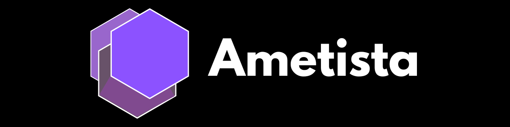

## Sumário
[Visão geral](#visão-geral)

[Entrada e saída de dados](#entrada-e-saída-de-dados)

[Variáveis](#variáveis)

[Constantes](#constantes)

[Estrutura condicional](#estrutura-condicional)

[Estrutura de repetição](#estrutura-de-repetição)

[Funções](#funções)

[Autor](#autor)

[Licença](#licença)

## Visão geral
Ametista originalmente foi pensada sem propósito algum, apenas como um desejo de seu desenvolvedor. Entretanto, se for necessário um motivo, ela visa seguir a mesma filosofia do Ruby de "desenvolvedor feliz", mas com o diferencial de ser uma linguagem compilada e consequentemente ter um maior desempenho nas aplicações.

## Entrada e saída de dados
### Saída
```
out "Olá, mundo!" ;; output sem quebra de linha
print "Olá, mundo!" ;; output com quebra de linha
```

### Entrada
```
str nome = input "Digite seu nome: "
```

## Tipos de dados
`int`, `float`, `bool`, `str`, `nil`, `list`, `table`

## Variáveis
```

   
int numero = 45
str texto = “Ametista”
bool status = true
float valor = 0.0
str frutas =[“maçã”, “banana”, “goiaba”]
table numeros_extenso = {“zero”: 0, “um”: 1, “dois”: 2}
```

## Constantes
```
const str linguagem = "Ametista"
```

## Estrutura condicional

### Condição simples
```
if (idade < 12) do
    out "Criança"
end
```

### Condição composta
```
if (idade < 12) do
    out "Criança"
else
    out "Adolescente"
end
```

### Condição aninhada
```
if (idade < 12) do
    out "Criança"
elif (idade < 18) do
    out "Adolescente"
else
    out "Adulto"
end
```

### Condição múltipla
```
choose letra begin
    case "A" do
        out "Você escolheu A"
    end
    case "B" do
        out "Você escolheu B"
    end
    other
        out "Você escolheu outra coisa"
    end
end
```


## Estrutura de repetição
### Estrutura while
```
while true do
    out "Ametista é bom"
end
```

### Estrutura do while
```
do
    out "Ametista é legal"
while numero < 50
```

### Estrutura for
```
for (int i = 0; i < idade; i++) do
    print i
end
```

## Funções

### Função sem retorno
```
defun helloWorld do
    out "Hello, World!"
end
```

### Função com retorno
```
defun str sayHello do
    return "Hello!"
end
```

### Função sem parâmetro
```
defun bool isNumber do
    return false
end
```

### Função com parâmetro
```
defun int somar(x, y) do
    return x + y
end
```

## Autor

<div style="display: inline-flex; flex-direction: column; align-items: center;">
  <a href="https://github.com/williamdev20">
    
  </a>
  <a href="https://github.com/williamdev20">William Alves</a>
</div>


## Licença
Este projeto está licenciado sob a licença [MIT]()
